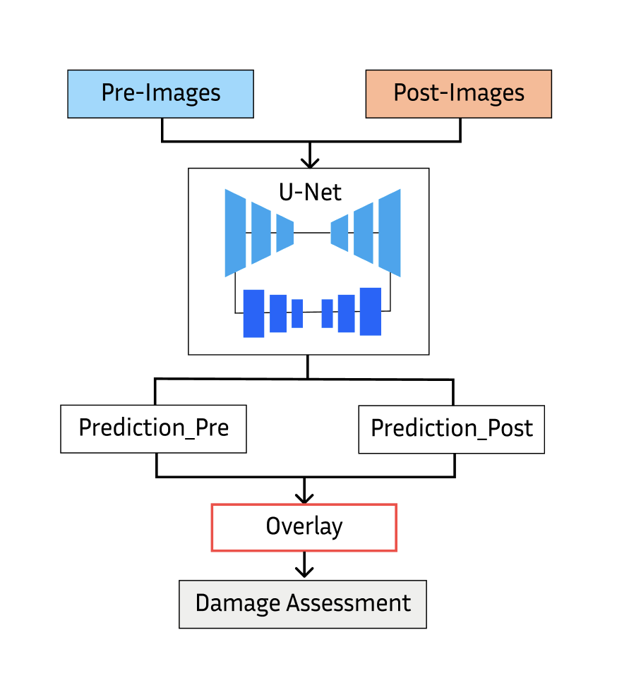
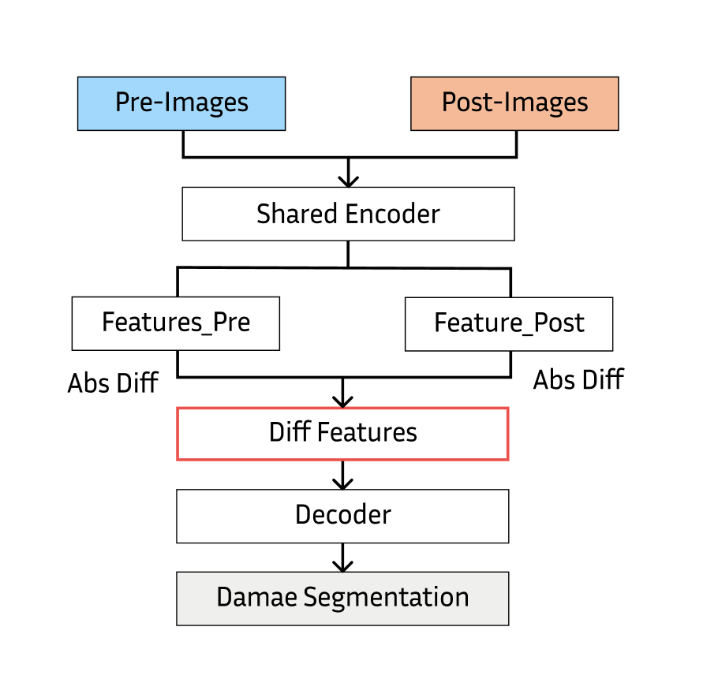

# xBD Road Damage Assessment

This repository contains the implementation code for a deep learning model that performs road damage assessment using **xBD** data.  
The project provides a complete pipeline from data preprocessing to model training, evaluation, and inference.

## Table of Contents

- [Project Overview](#project-overview)
- [Key Features](#key-features)
- [Requirements](#requirements)
- [Installation](#installation)
- [Dataset](#dataset)
- [Usage](#usage)
- [Experiment](#experiment)
- [Performance Comparison](#performance-comparison)
- [Result Visualization](#result-visualization)
- [Reproducible experiment](#reproducible-experiment)
- [How to Contribute](#how-to-contribute)
- [License](#license)
- [References](#references)

## Project Overview

This project implements a road damage assessment model using the xBD dataset.  
While the model primarily focuses on road damage assessment, it also performs road detection (semantic segmentation).
The model uses a deep learning-based network (PyTorch) and applies various preprocessing and data augmentation techniques to enhance learning performance.

## Key Features

- **End-to-End Pipeline:** Provides a complete workflow from data preprocessing to model training, evaluation, and inference
- **Modular Design:** Each module (data loader, model, training script, etc.) is independently structured for easy extension
- **User-Friendly Configuration:** Hyperparameters and path settings through configuration files (config.yaml, etc.)
- **GPU Support:** Fast training environment through CUDA support
- **Diverse Model Architectures:** Supports both UNet and SiameseDiffUNet models

## Requirements

- Python 3.8 or higher
- PyTorch
- CUDA (for GPU usage)
- Other Python libraries: numpy, opencv-python, albumentations, matplotlib, etc.  
  *(See `pyproject.toml` for details)*

## Installation

1. Clone the repository:
   ```bash
   git clone https://github.com/seunghyeokleeme/xBD_road_damage_assessment.git
   cd xBD_road_damage_assessment
   ```

2. Create and activate virtual environment (optional):
   ```bash
   # Using Python venv
   python3 -m venv venv
   source venv/bin/activate  # Linux/Mac
   venv\Scripts\activate     # Windows

   # Using uv venv
   uv venv
   ```


## Dataset

This project uses the **xBD dataset**. The dataset should be structured as follows:

**Note:** This project focuses on road segmentation, which requires road labels. Since the official xBD dataset does not provide them, we generated the ground-truth masks using the process detailed below.

```
datasets/
├── train/
│   ├── images/
│   │   ├── xxx_pre_disaster.png
│   │   └── xxx_post_disaster.png
│   └── targets/
│       └── xxx_post_disaster_target.png
├── hold/
│   ├── images/
│   └── targets/
└── test/
    ├── images/
    └── targets/
```

### Dataset Download Methods

1.  Download the dataset from the [official xBD page](https://xview2.org) and generate road labels yourself by following the hybrid labeling strategy outlined below.
2.  (Recommended) Download the pre-labeled road dataset from this [Google Drive link](https://drive.google.com/drive/folders/1Kd329puBn5_Nc_3Lg5READct4Whd7erR).

### Ground-Truth Generation Process

As the xBD dataset lacks official road annotations, a **Hybrid Labeling Strategy** was developed to generate high-quality ground-truth masks. This approach consists of three sequential steps:

1.  **Baseline Generation via Transfer Learning**

    * A U-Net model was first pre-trained using the `DeepGlobe Road Extraction` dataset, which provides high-fidelity, manually annotated road masks.
    * This pre-trained model was then applied to the pre-disaster images from the xBD dataset to infer baseline road labels.

2.  **Semi-Automated Labeling Pipeline**

    * Concurrently, we used `YOLOv9` for initial road detection.
    * The detected regions were then refined using the `Segment Anything Model (SAM)` to generate precise, pixel-level masks, enabling large-scale label generation.

3.  **Hybrid Validation and Quality Enhancement**

    * To ensure label quality, the outputs from both pipelines (1 and 2) were compared.
    * Cases with significant discrepancies were flagged for manual expert review, where the label was either corrected or selected based on fidelity (e.g., choosing the DeepGlobe-informed mask when SAM results were noisy).
    * This hybrid pipeline allowed us to construct a reliable, large-scale road mask dataset while minimizing annotation noise.

The final ground-truth masks generated through this process consist of three distinct pixel-level classes: **background (class 0)**, **undamaged road (class 1)**, and **damaged road (class 2)**. This serves as the foundational ground truth for the training and evaluation of all models in this study.


## Usage

### 1. Data Preprocessing
```bash
python3 ./data_read.py
```

### 2. Run TensorBoard
```bash
tensorboard --logdir='./log'
```

### 3. Model Type Selection
You can select the model during training and testing using the `--model_type` option:

- `"UNet"`: Basic UNet model
  - Uses `SingleDiffDataset` class to generate difference images
  - Calculates the difference between pre- and post-disaster images for road damage assessment
- `"SiameseDiffUNet"`: UNet model utilizing Siamese structure
  - Uses `FusionChangeDataset` class to process pre- and post-disaster images separately
  - Extracts and fuses features from both time points using Siamese structure

### 4. Model Training
```bash
python3 ./train.py \
  --lr 1e-3 \
  --batch_size 12 \
  --num_epoch 100 \
  --seed 0 \
  --data_dir "./datasets_512" \
  --ckpt_dir "./checkpoint_v1" \
  --log_dir "./log/exp1" \
  --result_dir "./results_v1" \
  --mode "train" \
  --model_type "UNet" \
  --train_continue "off"
```

### 5. Model Testing
```bash
python3 ./train.py \
  --lr 1e-3 \
  --batch_size 12 \
  --num_epoch 100 \
  --seed 0 \
  --data_dir "./datasets_512" \
  --ckpt_dir "./checkpoint_v1" \
  --log_dir "./log/exp1" \
  --result_dir "./results_v1" \
  --mode "test" \
  --model_type "UNet" \
  --train_continue "off"
```

### 6. Model Evaluation
```bash
python3 ./eval.py \
  --result_dir "./results_v1" \
  --out_fp "./localization_metrics.json"
```

## Experiment

### Experimental Model Descriptions

1. **Experiment 1 (Road Detection Semantic Segmentation)**
   - Performs inference on pre- and post-disaster images separately and overlays them for damage assessment
   - Refer to [xBD_road_segmentation](https://github.com/seunghyeokleeme/xBD_road_segmentation)
   - model archarchitecture: 
   

2. **Experiment 2 (UNet-based)**
   - Generates difference images using the `SingleDiffDataset` class
   - Difference image generation process:
     1. Load pre-disaster image (pre_image) and post-disaster image (post_image)
     2. Apply transforms to both images
     3. Create difference image by subtracting pre-disaster image from post-disaster image (`diff_image = post_image - pre_image`)
   - Uses the generated difference image as input for 3-class segmentation (background/normal road/damaged road)
   - Meaning of difference image:
     - Values close to zero: Unchanged areas (background or normal road)
     - Larger values: Areas with significant changes (damaged road)
   - model archarchitecture: 
   

3. **Experiment 3 (SiameseDiffUNet)**
   - Uses `FusionChangeDataset` class to input pre- and post-disaster images separately
   - Extracts features from both time points in the same space using Siamese structure
   - Performs road damage assessment in the decoder after feature fusion (or difference)
   - model archarchitecture: 
   

---

## Performance Comparison


## Result Visualization


## Reproducible experiment

| Model      | Metric      |   Seed 0 |   Seed 1 |   Seed 2 |   Seed 3 |   Mean |   Std. Dev. |
|:-----------|:------------|---------:|---------:|---------:|---------:|-------:|------------:|
| Overlay    | F1b         |    0.868 |    0.866 |    0.874 |    0.87  |  0.869 |       0.003 |
| Overlay    | Precision_b |    0.881 |    0.895 |    0.88  |    0.849 |  0.876 |       0.02  |
| Overlay    | Recall_b    |    0.855 |    0.839 |    0.868 |    0.893 |  0.864 |       0.023 |
| Overlay    | IoU_b       |    0.766 |    0.764 |    0.776 |    0.77  |  0.769 |       0.005 |
| Overlay    | F1s         |    0.26  |    0.26  |    0.262 |    0.261 |  0.261 |       0.001 |
| Difference | F1b         |    0.761 |    0.771 |    0.748 |    0.759 |  0.76  |       0.01  |
| Difference | Precision_b |    0.816 |    0.818 |    0.842 |    0.829 |  0.826 |       0.012 |
| Difference | Recall_b    |    0.713 |    0.73  |    0.672 |    0.699 |  0.704 |       0.024 |
| Difference | IoU_b       |    0.615 |    0.628 |    0.597 |    0.611 |  0.613 |       0.013 |
| Difference | F1d         |    0.526 |    0.554 |    0.479 |    0.529 |  0.522 |       0.031 |
| Difference | Precision_d |    0.633 |    0.619 |    0.657 |    0.645 |  0.638 |       0.016 |
| Difference | Recall_d    |    0.451 |    0.502 |    0.377 |    0.449 |  0.445 |       0.051 |
| Difference | IoU_d       |    0.357 |    0.384 |    0.315 |    0.36  |  0.354 |       0.029 |
| Difference | F1s         |    0.597 |    0.62  |    0.56  |    0.598 |  0.594 |       0.025 |
| Siamese    | F1b         |    0.628 |    0.718 |    0.638 |    0.73  |  0.678 |       0.053 |
| Siamese    | Precision_b |    0.877 |    0.884 |    0.915 |    0.868 |  0.886 |       0.02  |
| Siamese    | Recall_b    |    0.489 |    0.605 |    0.489 |    0.63  |  0.553 |       0.075 |
| Siamese    | IoU_b       |    0.457 |    0.56  |    0.468 |    0.575 |  0.515 |       0.061 |
| Siamese    | F1d         |    0.271 |    0.432 |    0.318 |    0.477 |  0.374 |       0.096 |
| Siamese    | Precision_d |    0.814 |    0.776 |    0.776 |    0.714 |  0.77  |       0.041 |
| Siamese    | Recall_d    |    0.163 |    0.299 |    0.2   |    0.358 |  0.255 |       0.09  |
| Siamese    | IoU_d       |    0.157 |    0.275 |    0.189 |    0.313 |  0.234 |       0.073 |
| Siamese    | F1s         |    0.378 |    0.518 |    0.414 |    0.553 |  0.466 |       0.083 |

## How to Contribute

1. Fork the repository.
2. Create a new branch (`git checkout -b feature/YourFeature`).
3. Modify and improve the code.
4. Commit your changes (`git commit -m 'Add some feature'`).
5. Push to the remote repository (`git push origin feature/YourFeature`).
6. Create a Pull Request.

## License

This project is distributed under the [MIT License](LICENSE).

## References

- [xBD Official Page](https://xview2.org)
- [PyTorch Documentation](https://pytorch.org/docs/)
- [Unet: Convolutional Networks for Biomedical Image Segmentation](https://arxiv.org/abs/1505.04597)
- Gupta, R. et al. (2019). "xBD: A dataset for assessing building damage from satellite imagery." *arXiv preprint arXiv:1911.09296*. [arXiv](https://arxiv.org/abs/1911.09296)
- Alisjahbana, I. et al. (2024). "DeepDamageNet: A two-step deep-learning model for multi-disaster building damage segmentation and classification using satellite imagery." *arXiv preprint arXiv:2405.04800*. [arXiv](https://arxiv.org/abs/2405.04800) 
